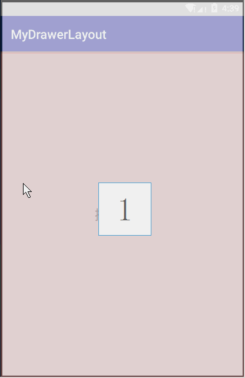

# ViewDragHelperDemo
ViewDragHelper---自定义ViewGroup神器
# 概述
自定义ViewGroup的时候，子view和用户进行交互是常有的事，即用户拖动某个子view(eg:侧滑菜单)。针对具体需求重写onInterceptTouchEvent和onTouchEvent不是件容易的事。

好在官方在V4包中提供了一个辅助类ViewDragHelper，在我们自定义ViewGroup的时候帮助我们处理子view拖动等事件。简单看一下官方解释：
```java
ViewDragHelper is a utility class for writing custom ViewGroups. It offers a number of useful operations and state tracking for allowing a user to drag and reposition views within their parent ViewGroup.
```

本档案库中包含3个module，分别是Demo1,Demo2,MyDrawerLayout；前两个用来演示ViewDragHelper的简单用法，最后一个利用ViewDragHelper实现DrawerLayout。

# ViewDragHelper初探之Demo1
Demo1简单演示一下ViewDragHelper用法:
* ViewDragHelper实例的创建
* 触摸相关方法的调用
* ViewDragHelper.Callback内部类的编写

自定义ViewGroup：
```java
public class VDHLayout extends LinearLayout
{
    private ViewDragHelper mDragger;

    public VDHLayout(Context context, AttributeSet attrs)
    {
        super(context, attrs);

	//创建ViewDragHelper实例
        mDragger = ViewDragHelper.create(this, 1.0f, new ViewDragHelper.Callback()
        {
            @Override
            public boolean tryCaptureView(View child, int pointerId)
            {
                return true;
            }

            @Override
            public int clampViewPositionHorizontal(View child, int left, int dx)
            {
                //边界控制，横向移动控制在viewgroup内部
                int paddingLeft = getPaddingLeft();
                int rightBound = getWidth() - getPaddingRight() - child.getWidth();
                //控制左边
                left = left < paddingLeft ? paddingLeft : left;
                //控制右边
                left = left > rightBound ?
                        rightBound : left;

                return left;
            }

            @Override
            public int clampViewPositionVertical(View child, int top, int dy)
            {
                return top;
            }

        });
    }

    @Override
    public boolean onInterceptTouchEvent(MotionEvent ev)
    {
        return  mDragger.shouldInterceptTouchEvent(ev);
    }

    @Override
    public boolean onTouchEvent(MotionEvent event)
    {
        mDragger.processTouchEvent(event);
        return true;
    }
}
```
分析一下，使用ViewDragHelper有3个步骤：

* 1.创建实例
```java
mDragger = ViewDragHelper.create(this, 1.0f, new ViewDragHelper.Callback()
		{
			//...
		});
```
需要三个参数，第一个就是ViewGroup；第二个sesitivity,主要用于设置touchslop，1.0f是常用值；第三个是Callback，在用户回调过程中会调用相关方法。

* 2.将MotionEvent交给ViewDragHelper
```java
@Override
public boolean onInterceptTouchEvent(MotionEvent ev)
{
	return  mDragger.shouldInterceptTouchEvent(ev);
}

@Override
public boolean onTouchEvent(MotionEvent event)
{
	mDragger.processTouchEvent(event);
	return true;
}
```
OK,没什么好说的；通过mDragger.shouldInterceptTouchEvent(ev)来决定我们是否应该拦截当前事件；mDragger.processTouchEvent(event);来处理事件。

* 3.ViewDragHelper.Callback中相关方法
```java
@Override
public boolean tryCaptureView(View child, int pointerId)
{
	return true;
}

@Override
public int clampViewPositionHorizontal(View child, int left, int dx)
{
	//边界控制，横向移动控制在viewgroup内部
	int paddingLeft = getPaddingLeft();
	int rightBound = getWidth() - getPaddingRight() - child.getWidth();
	//控制左边
	left = left < paddingLeft ? paddingLeft : left;
	//控制右边
	left = left > rightBound ?
		rightBound : left;

	return left;
}

@Override
public int clampViewPositionVertical(View child, int top, int dy)
{
	return top;
}
```
ViewDragHelper中拦截和处理事件时，会调用Callback中的很多方法决定一些事：比如哪些子view可以移动，移动的范围是什么，子view的边界控制等。

下面说明一下这三个方法：
```java
public boolean tryCaptureView(View child, int pointerId)
```
返回true，则表示可以捕获该view。第一个参数就是捕获的view。

```java
public int clampViewPositionHorizontal(View child, int left, int dx);

public int clampViewPositionVertical(View child, int top, int dy);
```
这两个方法用来锁定子view移动后的位置。上面方法中对水平移动范围进行的控制，即只能在ViewGroup中移动。而垂直移动范围没有限制，直接return top;

OK,下面贴一下布局文件：
```java
<?xml version="1.0" encoding="utf-8"?>
<cn.hzh.vdh.view.VDHLayout
    xmlns:android="http://schemas.android.com/apk/res/android"
    android:layout_width="match_parent"
    android:layout_height="match_parent"
    android:orientation="vertical"
    android:paddingLeft="@dimen/activity_horizontal_margin"
    android:paddingRight="@dimen/activity_horizontal_margin"
    android:paddingTop="@dimen/activity_vertical_margin"
    android:paddingBottom="@dimen/activity_vertical_margin">

    <TextView
        android:text="Hello World!"
        android:layout_width="100dp"
        android:layout_height="100dp"
        android:layout_margin="10dp"
        android:background="#44ff0000"
        android:layout_gravity="center"
        android:gravity="center"/>

    <TextView
        android:text="Hello World!"
        android:layout_width="100dp"
        android:layout_height="100dp"
        android:layout_margin="10dp"
        android:background="#44ff0000"
        android:layout_gravity="center"
        android:gravity="center"/>

    <TextView
        android:text="Hello World!"
        android:layout_width="100dp"
        android:layout_height="100dp"
        android:layout_margin="10dp"
        android:background="#44ff0000"
        android:layout_gravity="center"
        android:gravity="center"/>

</cn.hzh.vdh.view.VDHLayout>
```
Demo1效果图：


# ViewDragHelper初探之Demo2
对ViewDragHelper有了直观认识之后，我们继续学习ViewDragHelper其他功能。
* edge检测(eg: DrawerLayout是边界触发拉出菜单)
* 回调Drag release(手指抬起的时候，菜单自动展开/收缩)
* 移动到指定位置(eg:点击button，可以自动展开/收缩菜单)

我们在Demo1的基础上添加上面三个操作；

首先看一下效果图：


* 第一个子view和Demo1一样
* 第二个子view，除了移动之外，松手就回到原本的位置
* 第三个子view，在边界移动时才操作该子view

由于代码比较长，下面分段贴上相应的代码：
```java
@Override
public boolean tryCaptureView(View child, int pointerId)
{
	//mEdgeTrackerView禁止直接移动
	return child == mDragView || child == mAutoBackView;
}
```
这里我们对第三个子view禁止直接移动；即，当用户touch第三个子view上时，tryCaptureView()方法return false; 那么这个方法return false的直接后果就是不会执行dragTo()方法，该方法是ViewDragHelper内部的私有方法，实现对capturedView进行移动。

```java
/**
* 手指释放时的回调以及相关方法
*/
@Override
public void onViewReleased(View releasedChild, float xvel, float yvel)
{
	if(releasedChild == mAutoBackView)
	{
	    mDragger.settleCapturedViewAt(mAutoBackOriginPos.x, mAutoBackOriginPos.y);
	    invalidate();
	}
}

@Override
public void computeScroll()
{
	if(mDragger.continueSettling(true))
	{
	    invalidate();
	}
}
```
这里调用了ViewDragHelper中的settleCapturedViewAt()方法，让CapturedView移动到指定位置。内部使用scroller对象实现移动的。所以需要调用invalidate(),并配合computeScroll()方法实现移动。

```java
//边界拖动时的回调
@Override
public void onEdgeDragStarted(int edgeFlags, int pointerId)
{
	mDragger.captureChildView(mEdgeTrackerView, pointerId);
}

//enable EdgeTracking
mDragger.setEdgeTrackingEnabled(ViewDragHelper.EDGE_LEFT);
```
Callback.onEdgeDragStarted()方法在用户touch屏幕edge的时候触发，在里面我们调用ViewDragHelper的captureChildView()方法设置第三个子view为capturedView；当然还需要手动enable EdgeTracking。

下面贴一下其他方法
```java
@Override
protected void onFinishInflate()
{
    super.onFinishInflate();

    mDragView = getChildAt(0);
    mAutoBackView = getChildAt(1);
    mEdgeTrackerView = getChildAt(2);
}

@Override
//初始化，第二个子view的初始位置
protected void onLayout(boolean changed, int l, int t, int r, int b)
{
    super.onLayout(changed, l, t, r, b);

    mAutoBackOriginPos.x = mAutoBackView.getLeft();
    mAutoBackOriginPos.y = mAutoBackView.getTop();
}
```
最后，还有一点需要说明。如果把三个子view的clickable设置为true，即让子view能够消耗事件。你会发现原先能拖拽的子view现在已经无法移动。

解释一下这种情况：
* 如果子view不能消耗事件，那么事件(从DOWN到UP)最终都进ViewGroup的onTouchEvent()方法，
里面调用mDragger.processTouchEvent(event);这样ViewDragHelper的processTouchEvent()方法能正常通过dragTo()方法移动子view
* 如果子view消耗了事件，那么就得根据mDragger.shouldInterceptTouchEvent(ev)函数的返回值，查看源码你发现你需要重写如下两个方法才能让mDragger.shouldInterceptTouchEvent返回true
```java
@Override
public int getViewHorizontalDragRange(View child)
{
	return getMeasuredWidth() - child.getMeasuredWidth();
}

@Override
public int getViewVerticalDragRange(View child)
{
	return getMeasuredHeight() - child.getMeasuredHeight();
}
```
上面方法默认返回0。如果返回0，mDragger.shouldInterceptTouchEvent()就返回false。只有getViewHorizontalDragRange和getViewVerticalDragRange返回大于0，才可以对事件进行捕获。

OK,至此Demo2分析完毕。

# ViewDragHelper实战之实现DrawerLayout
打算按如下步骤实现MyDrawerLayout类的编写
* 通过自定义ViewGroup实现，重写onMeasure,onLayout实现对自身以及子view测量和布局
* 引入ViewDragHelper实现对LeftMenu的拖拽
* 编写activity和fragment对MyDrawerLayout类进行测试

先贴一下布局文件
```java
<cn.hzh.mydrawerlayout.MyDrawerLayout
    xmlns:android="http://schemas.android.com/apk/res/android"
    xmlns:tools="http://schemas.android.com/tools"
    android:layout_width="match_parent"
    android:layout_height="match_parent"
    android:id="@+id/id_drawer_layout"
    tools:showIn="@layout/activity_main"
    tools:context=".MainActivity">

    <RelativeLayout
        android:clickable="true"
        android:layout_width="match_parent"
        android:layout_height="match_parent"
        android:background="#44ff0000">
        <TextView
            android:id="@+id/id_content"
            android:layout_width="wrap_content"
            android:layout_height="wrap_content"
            android:gravity="center"
            android:layout_centerInParent="true"
            android:text="hello world"
            android:textSize="22sp"/>
    </RelativeLayout>

    <FrameLayout
        android:id="@+id/id_container_menu"
        android:layout_width="match_parent"
        android:layout_height="match_parent"
        android:background="#4400ff00">
    </FrameLayout>
    
</cn.hzh.mydrawerlayout.MyDrawerLayout>
```
第一个子view显示内容；第二个子view显示左侧菜单；

OK，下面分析代码

* 1.首先对子view测量和布局
```java
public class MyDrawerLayout extends ViewGroup
{

    private static final int MIN_Drawer_MARGIN_RIGHT = 64;      //dp
    //MenuView完全展开时，离容器的右边距：64dp
    private int mMinDrawerRightMargin;
    //控制LeftMenu显示宽度的比例值: 0.0f ~ 1.0f
    private float mMenuWidthRatio = 0.0f;

    private View mContentView;
    private View mMenuView;

    public MyDrawerLayout(Context context, AttributeSet attrs)
    {
        super(context, attrs);

        //在160dpi的屏幕上，density=1
        float density = getResources().getDisplayMetrics().density;
        //64dp对应的像素值
        mMinDrawerRightMargin = (int) (MIN_Drawer_MARGIN_RIGHT*density + 0.5f);
    }

    @Override
    protected void onMeasure(int widthMeasureSpec, int heightMeasureSpec)
    {
        int width = MeasureSpec.getSize(widthMeasureSpec);
        int height = MeasureSpec.getSize(heightMeasureSpec);
        setMeasuredDimension(width, height);

        //measure child
        View leftMenuView = getChildAt(1);
        MarginLayoutParams lp = (MarginLayoutParams) leftMenuView.getLayoutParams();
        int drawerWidthSpec = getChildMeasureSpec(widthMeasureSpec,
                mMinDrawerRightMargin + lp.leftMargin+lp.rightMargin, lp.width);
        int drawerHeightSpec = getChildMeasureSpec(heightMeasureSpec,
                lp.topMargin + lp.bottomMargin, lp.height);
        leftMenuView.measure(drawerWidthSpec, drawerHeightSpec);

        //measure child
        View contentView = getChildAt(0);
        lp = (MarginLayoutParams) contentView.getLayoutParams();
        int contentWidthSpec = MeasureSpec.makeMeasureSpec(width - lp.leftMargin - lp.rightMargin,
                MeasureSpec.EXACTLY);
        int contentHeightSpec = MeasureSpec.makeMeasureSpec(height - lp.topMargin - lp.bottomMargin,
                MeasureSpec.EXACTLY);
        contentView.measure(contentWidthSpec, contentHeightSpec);

        mMenuView = leftMenuView;
        mContentView = contentView;
    }

    @Override
    protected void onLayout(boolean changed, int l, int t, int r, int b)
    {
        View menuView = mMenuView;
        View contentView = mContentView;

        //摆放contentView
        MarginLayoutParams lp = (MarginLayoutParams) contentView.getLayoutParams();
        contentView.layout(lp.leftMargin, lp.topMargin,
                lp.leftMargin+contentView.getMeasuredWidth(), lp.topMargin+contentView.getMeasuredHeight());

        //摆放menuView
        lp = (MarginLayoutParams) menuView.getLayoutParams();
        int menuWidth = menuView.getMeasuredWidth();
        //mMenuWidthRatio: 0~1; left: -menuWidth~0
        int left = -menuWidth + (int)(menuWidth * mMenuWidthRatio);
        menuView.layout(left, lp.topMargin,
                left+menuWidth, lp.topMargin + menuView.getMeasuredHeight());
    }

    @Override
    protected LayoutParams generateDefaultLayoutParams()
    {
        return new MarginLayoutParams(LayoutParams.MATCH_PARENT, LayoutParams.MATCH_PARENT);
    }

    @Override
    protected LayoutParams generateLayoutParams(LayoutParams p)
    {
        return new MarginLayoutParams(p);
    }

    @Override
    public LayoutParams generateLayoutParams(AttributeSet attrs)
    {
        return new MarginLayoutParams(getContext(), attrs);
    }
}
```
常量MIN_Drawer_MARGIN_RIGHT用于定义当menu展开的时候，距离ViewGroup右侧的margin，这里写死为64dp。
在构造函数中通过
```java
float density = getResources().getDisplayMetrics().density;
mMinDrawerRightMargin = (int) (MIN_Drawer_MARGIN_RIGHT*density + 0.5f);
```
这两行代码，把64dp转换成设备对应的像素值大小。用变量mMinDrawerRightMargin记录。

在onMeasure方法中确定了mMenuView和mContentView的宽度高度，mMenuView通过ViewGroup的getChildMeasureSpec (int spec, int padding, int childDimension)
方法确定自己的MeasureSpec;mContentView通过MeasureSpec.makeMeasureSpec确定自己的MeasureSpec；
最后调用measure方法进行测量；注意，这里使用MarginLayoutParams，所以要复写相关方法。

接下来在在onLayout方法中进行布局子view。摆放contentView很简单，就不多说了。在摆放menuView使用了比例mMenuWidthRatio
变量来确定menuView的left值。这里使用这种方法确定left值得原因是：下面需要根据用户的touch动态改变mMenuWidthRatio比例值。

下面看效果图：

mMenuWidthRatio = 0.0f


mMenuWidthRatio = 1.0f


* 2.引入ViewDragHelper实现对LeftMenu的拖拽
初始化ViewDragHelper
```java
mDrag = ViewDragHelper.create(this, 1.0f, new ViewDragHelper.Callback()
        {
            @Override
            public boolean tryCaptureView(View child, int pointerId)
            {
                return child == mMenuView;
            }

            //将left锁定在-menuWidth ~ 0
            @Override
            public int clampViewPositionHorizontal(View child, int left, int dx)
            {
                int width = child.getWidth();
                left = left < -width ? -width : left;
                left = left > 0 ? 0 : left;
                return left;
            }

            @Override
            public void onViewReleased(View releasedChild, float xvel, float yvel)
            {
                int width = releasedChild.getWidth();
                //offset : 0 ~ 1 展开时为1，隐藏时为0
                float offset = (width + releasedChild.getLeft()) * 1.0f / width;
                int finalLeft = xvel > 0 || xvel == 0 && offset > 0.5f ? 0 : -width;
                int finalTop = releasedChild.getTop();

                mDrag.settleCapturedViewAt(finalLeft, finalTop);
                invalidate();
            }

            @Override
            public void onViewPositionChanged(View changedView, int left, int top, int dx, int dy)
            {
                int width = changedView.getWidth();
                //offset : 0 ~ 1 展开时为1，隐藏时为0
                float offset = (width + changedView.getLeft()) * 1.0f / width;
                mMenuWidthRatio = offset;

                changedView.setVisibility(offset == 0 ? INVISIBLE : VISIBLE);
                invalidate();
            }

            @Override
            public void onEdgeDragStarted(int edgeFlags, int pointerId)
            {
                mDrag.captureChildView(mMenuView, pointerId);
            }

            @Override
            public int getViewHorizontalDragRange(View child)
            {
                return child == mMenuView ? child.getWidth() : 0;
            }
        });
 mDrag.setEdgeTrackingEnabled(ViewDragHelper.EDGE_LEFT);
 mDrag.setMinVelocity(minVel);
```
下面把重写的方法解释一下
* tryCaptureView: 我们是edge触发拖动，为什么还要复写这个方法？因为当leftMenu展开的时候，我们仍需要直接拖动mMenuView
* clampViewPositionHorizontal: 锁定leftMenu的水平移动位置；从代码中可见left范围：-menuWidth ~ 0
* onViewReleased: 释放子view的时候触发；通过计算当前子view显示的百分比以及加速度来决定是否显示mMenuView，
这里注意一点，xvel的值只有大于我们设置的minvel才会大于0，如果小于我们设置的minVel则一直是0
* onViewPositionChanged: 这个回调主要功能就是更新mMenuWidthRatio，以及强制view重绘(invalidate)
* onEdgeDragStarted: 当用户touch屏幕的edge的时候触发，这里手动把mMenuView设置为capturedView
* getViewHorizontalDragRange: 这里上面解释过了，主要第一、设置子view的移动范围；第二、防止子view消耗事件

别忘了把MotionEvent交给ViewDragHelper
```java
@Override
public boolean onInterceptTouchEvent(MotionEvent ev)
{
	return mDrag.shouldInterceptTouchEvent(ev);
}

@Override
public boolean onTouchEvent(MotionEvent event)
{	
	mDrag.processTouchEvent(event);
	return true;
}
```

由于在onViewReleased里面使用了mDrag.settleCapturedViewAt(finalLeft, finalTop);所以别忘了复写computeScroll方法
```java
@Override
public void computeScroll()
{
	if(mDrag.continueSettling(true))
	{
	    invalidate();
	}
}
```

OK，最后对外公布几个API
```java
public void openDrawer()
{
	View menuView = mMenuView;
	mMenuWidthRatio = 1.0f;
	mDrag.smoothSlideViewTo(menuView, 0, menuView.getTop());
	invalidate();
}

public void closeDrawer()
{
	View menuView = mMenuView;
	mMenuWidthRatio = 0.0f;
	mDrag.smoothSlideViewTo(menuView, -menuView.getWidth(), menuView.getTop());
	invalidate();
}

public void toggle()
{
	if(mMenuWidthRatio == 0.0f)
	{
	    openDrawer();
	}else if(mMenuWidthRatio == 1.0f)
	{
	    closeDrawer();
	}
}
```
那么，MyDrawerLayout类就分析结束了

* 3.编写Activity和Fragment进行测试

Activity代码：
```java
public class MainActivity extends AppCompatActivity
{

    private MyDrawerLayout mDrawerLayout;
    private TextView mContent;
    private LeftMenuFragment mLeftMenuFragment;

    @Override
    protected void onCreate(Bundle savedInstanceState)
    {
        super.onCreate(savedInstanceState);
        setContentView(R.layout.activity_main);
        Toolbar toolbar = (Toolbar) findViewById(R.id.toolbar);
        setSupportActionBar(toolbar);

        mDrawerLayout = (MyDrawerLayout) findViewById(R.id.id_drawer_layout);
        mContent = (TextView) findViewById(R.id.id_content);

        FragmentManager fm = getSupportFragmentManager();
        mLeftMenuFragment = (LeftMenuFragment) fm.findFragmentById(R.id.id_container_menu);
        if(mLeftMenuFragment == null)
        {
            mLeftMenuFragment = new LeftMenuFragment();
            fm.beginTransaction().add(R.id.id_container_menu, mLeftMenuFragment).commit();
        }

        mLeftMenuFragment.setOnMenuItemSelectedListener(new LeftMenuFragment.OnMenuItemSelectedListener()
        {
            @Override
            public void onItemSelected(String text)
            {
                mDrawerLayout.closeDrawer();
                mContent.setText(text);
            }
        });

    }
}
```
很简单，就new了一个LeftMenuFragment，然后通过fm添加到activity中去；

LeftMenuFragment代码
```java
public class LeftMenuFragment extends ListFragment
{

    private MenuAdapter mAdatper;
    String[] strs = new String[]
            {"播放列表", "我的乐库", "立即播放"};
    MenuItem mDatas[] = new MenuItem[strs.length];

    public interface OnMenuItemSelectedListener
    {
        void onItemSelected(String text);
    }
    private OnMenuItemSelectedListener mListener;

    @Override
    public void onCreate(Bundle savedInstanceState)
    {
        super.onCreate(savedInstanceState);

        MenuItem item = null;
        for(int i = 0; i < mDatas.length; i++)
        {
            item = new MenuItem(strs[i],
                    R.mipmap.music_36px, R.mipmap.music_36px_light);
            mDatas[i] = item;
        }
    }

    @Override
    public void onViewCreated(View view, Bundle savedInstanceState)
    {
        super.onViewCreated(view, savedInstanceState);
        view.setBackgroundColor(0xffffffff);
        mAdatper = new MenuAdapter(getActivity(), mDatas);
        setListAdapter(mAdatper);
    }

    @Override
    public void onListItemClick(ListView l, View v, int position, long id)
    {
        super.onListItemClick(l, v, position, id);

        if(mListener != null)
        {
            MenuAdapter adapter = (MenuAdapter) getListAdapter();
            mListener.onItemSelected(adapter.getItem(position).text);
        }

        mAdatper.setSelected(position);
    }

    public void setOnMenuItemSelectedListener(OnMenuItemSelectedListener listener)
    {
        this.mListener = listener;
    }

    public class MenuAdapter extends ArrayAdapter<MenuItem>
    {
        private LayoutInflater mInflater;
        //这个变量实现 选中后状态改变
        private int mSelected;

        private Context mContext;
        private int mIconSize;

        public MenuAdapter(Context context, MenuItem[] mDatas)
        {
            super(context, -1, mDatas);

            mContext = context;
            mInflater = LayoutInflater.from(context);

            //24dp
            mIconSize = mContext.getResources().getDimensionPixelSize(R.dimen.drawer_icon_size);
        }

        @Override
        public View getView(int position, View convertView, ViewGroup parent)
        {
            if(convertView == null)
            {
                convertView = mInflater.inflate(R.layout.drawer_menu_item, parent, false);
            }
            TextView tv = (TextView) convertView;
            tv.setBackgroundColor(Color.TRANSPARENT);
            tv.setText(getItem(position).text);
            Drawable icon = mContext.getResources().getDrawable(getItem(position).icon);
            icon.setBounds(0,0,mIconSize, mIconSize);
            TextViewCompat.setCompoundDrawablesRelative(tv, icon, null, null, null);

            if(position == mSelected)
            {
                tv.setBackgroundColor(0x4400ff00);
                icon = mContext.getResources().getDrawable(getItem(position).iconSelected);
                icon.setBounds(0,0,mIconSize, mIconSize);
                TextViewCompat.setCompoundDrawablesRelative(tv, icon, null, null, null);
            }

            return convertView;
        }

        public void setSelected(int position)
        {
            this.mSelected = position;
            notifyDataSetChanged();
        }
    }

    public class MenuItem
    {
        String text;
        int icon;
        int iconSelected;

        public MenuItem(String text, int icon, int iconSelected)
        {
            this.text = text;
            this.icon = icon;
            this.iconSelected = iconSelected;
        }
    }
}
```
* MenuItem以及adapter都已内部类的形式写里面了。
* 在MenuAdapter中对外公布了setSelected方法，这个方法的作用就是: 外面选中某一个Item的时候设置选中后的Item的状态。

下面贴上drawer_menu_item.xml布局文件
```java
<?xml version="1.0" encoding="utf-8"?>
<TextView
    xmlns:android="http://schemas.android.com/apk/res/android"
    android:layout_width="match_parent"
    android:layout_height="?attr/listPreferredItemHeightSmall"
    android:drawablePadding="32dp"
    android:gravity="center_vertical|start"
    android:maxLines="1"
    android:paddingLeft="?attr/listPreferredItemPaddingLeft"
    android:paddingRight="?attr/listPreferredItemPaddingRight"
    android:textAppearance="?attr/textAppearanceListItem"
    android:textColor="?android:attr/textColorPrimary"/>
```

OK,最后看一下效果：

